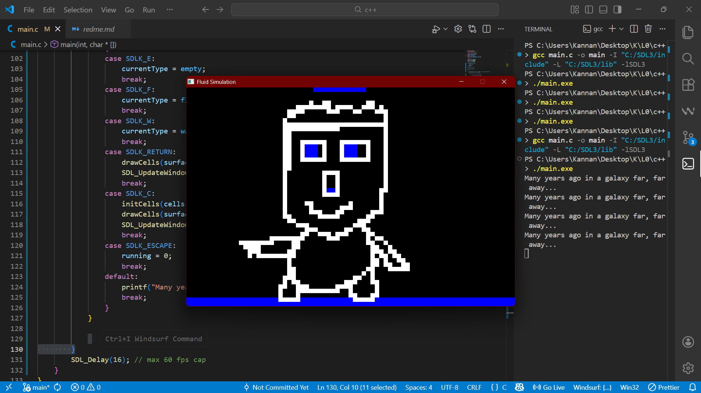
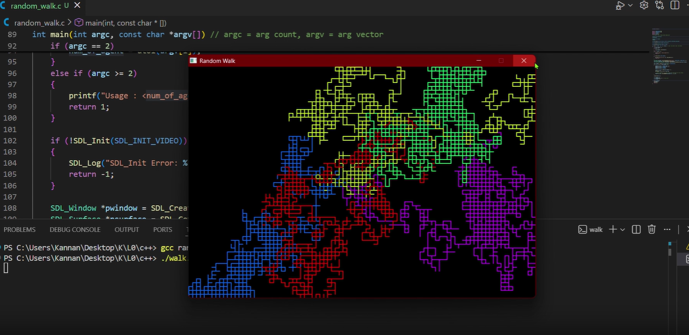
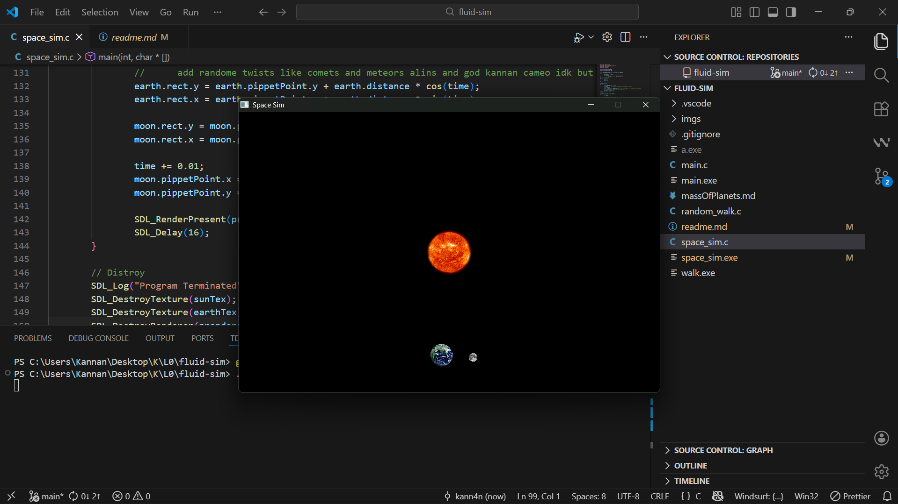
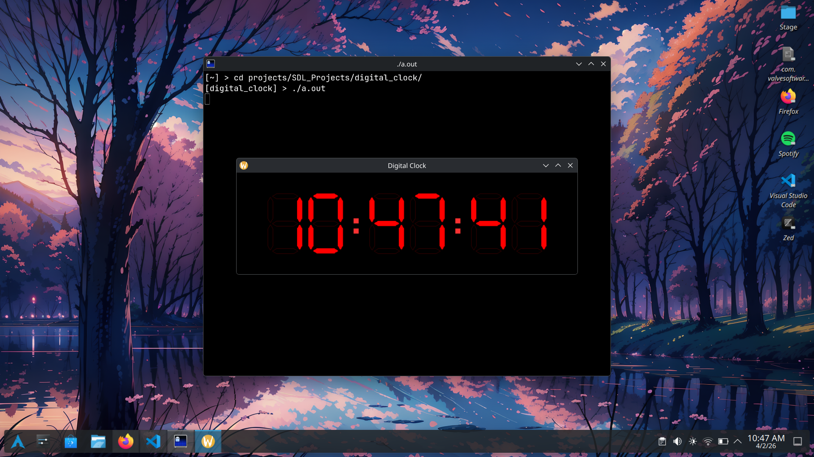
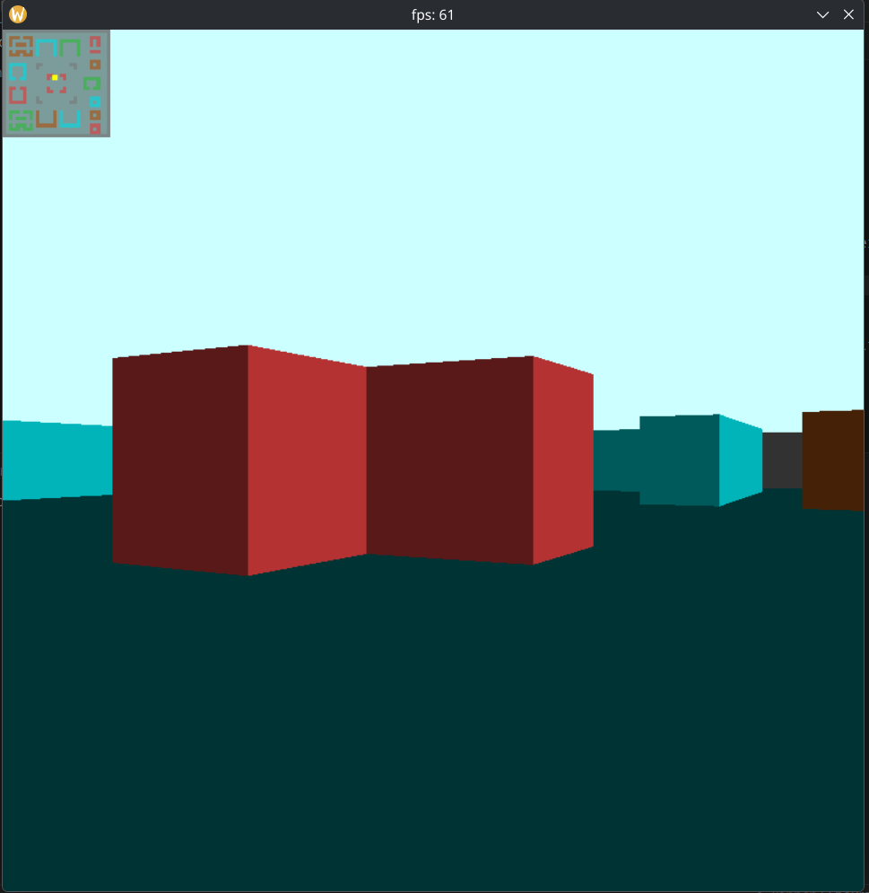
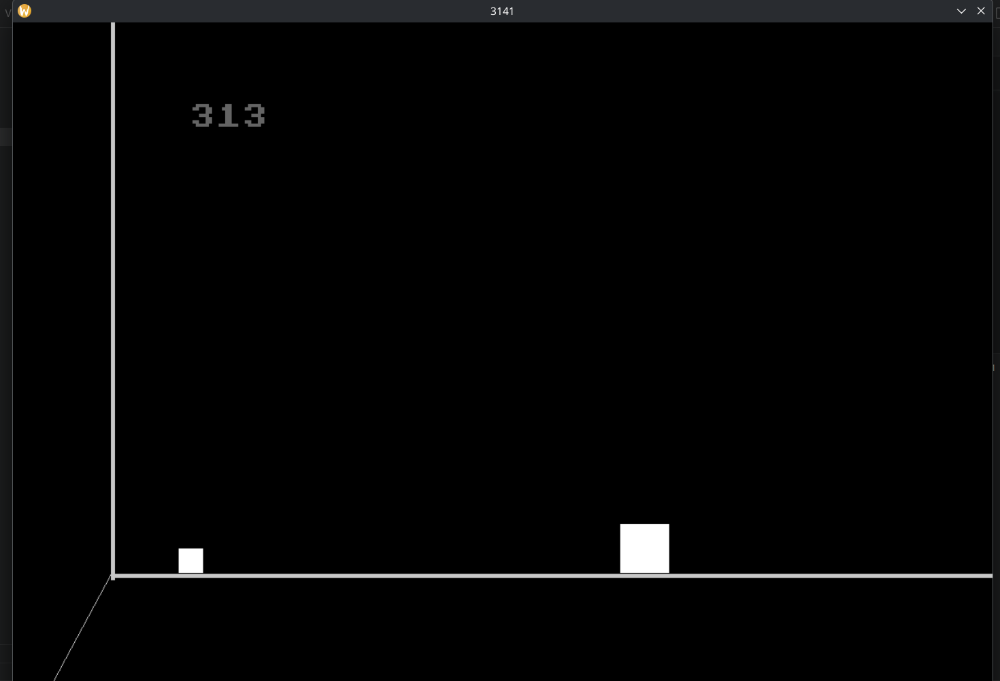

# SDL Projects


A collection of interactive simulations and games built with SDL3.

## Setup

### Install SDL3

Arch Linux:

```bash
sudo pacman -S sdl3
```

Windows (MSYS2 UCRT64 shell):

```bash
pacman -S mingw-w64-ucrt-x86_64-SDL3
```

### Build and run (example)

From the project root:

```bash
gcc doom/doom.c doom/kengine.c -o game -lSDL3 -lm && ./game
```

### Screenshots

<div style="display: flex; flex-wrap: wrap; gap: 20px">

<div>
    <h3>Fluid</h3>
    
</div>

<div>
    <h3>Random Walk</h3>
    
</div>

<div>
    <h3>Space Sim</h3>
    
</div>

<div>   
    <h3>Digital Clock</h3>
    
</div>

<div>
    <h3>Doom</h3>
    
</div>

<div>    
    <h3>3141</h3>
    <br>
    [But Why?](https://www.youtube.com/watch?v=jsYwFizhncE)
</div>

</div>
